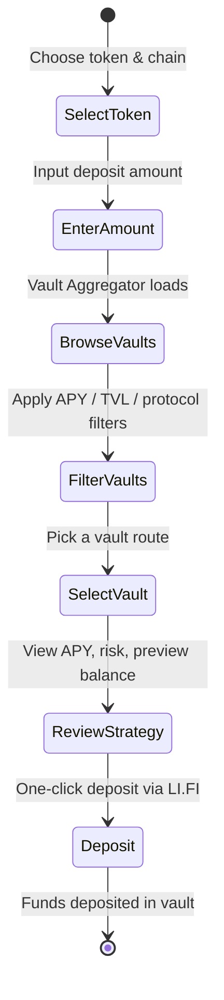

<div align="center">
  

# Yieldo

**Best yield, one click. Aggregated live from 20+ DeFi protocols.**
**Find the highest-APY vault route, deposit in a single transaction.**

[](https://li.fi)
[](https://lifi.notion.site/defi-mullet-hackathon-1-builder-edition)
[](https://lifi.notion.site/defi-mullet-hackathon-1-builder-edition)
[](./LICENSE)

</div>

---

## What is Yieldo?

Yield farming is fragmented. Dozens of protocols, hundreds of vaults, scattered across chains. Finding the best opportunity means checking Aave, Morpho, Euler, Yo Protocol, and more — one by one.

**Yieldo** solves this by aggregating every vault opportunity in real time via the **LI.FI Earn API**. Pick a token, pick a chain, and instantly see the best yield routes ranked by APY, TVL, and risk tier. One-click deposit handles the swap, bridge, and deposit in a single signed transaction through **LI.FI Composer**.

Think: **DEX aggregator UX, applied to yield vaults.**

---

## Why Yieldo Exists

### Who This Is For

Meet Dani. She's a yield farmer who's been rotating capital across DeFi for two years — supply USDC on Aave when rates spike, move to Morpho when Aave gets crowded, bridge to Base when a new Euler vault launches with boosted rewards, then pull everything back to stables before a governance vote shakes the TVL.

She's good at it. Her portfolio is up 19% this year, beating most passive strategies.

But Dani has a problem. Every time she wants to move, she has to manually check six protocol dashboards across four chains. She opens Aave on Arbitrum, Morpho on Ethereum, Euler on Base, compares APYs in a spreadsheet, checks TVLs on DefiLlama, evaluates risk by reading governance forums. Then she executes: approve token, swap if needed, bridge to the right chain, deposit into the vault. Four transactions, three gas payments, twenty minutes. By the time she's done, the rate she was chasing has already dropped because everyone else saw the same opportunity.

She tried yield aggregators, but they only show their own vaults. She tried DeFi dashboards, but they're read-only — she still has to go to each protocol to deposit. And none of them handle cross-chain deposits. If the best vault is on a different chain than where her funds sit, she's on her own with the bridge.

### What Dani Actually Needs

Dani doesn't need another dashboard. She needs a **yield route finder** — something that scans every vault across every protocol and chain, ranks them by APY, lets her filter by risk and TVL, and then handles the entire deposit in one click. Swap, bridge, deposit — a single signed transaction.

That's Yieldo.

Yieldo treats yield vaults the way DEX aggregators treat token swaps. You don't manually check Uniswap, SushiSwap, and Curve to find the best swap rate — the aggregator does it for you. Yieldo does the same thing for yield: it aggregates 20+ protocols via the LI.FI Earn API, surfaces the best opportunities in real time, and executes the deposit through LI.FI Composer. One interface. One transaction. Best rate.

Dani opens Yieldo, types "3000 USDC on Arbitrum," and instantly sees 15 vault routes ranked by APY. She filters for >5% APY and >$1M TVL, spots a Morpho vault on Base at 6.63%. She clicks it, reviews the strategy — APY, 30-day average, risk tier, timelock — then hits deposit. LI.FI handles the Arbitrum-to-Base bridge and the Morpho deposit in a single transaction. Twenty minutes of work, compressed into ten seconds.

---

## Problem

| Problem | Description |
|---------|-------------|
| **Fragmented Yield** | Vault opportunities are scattered across 20+ protocols and multiple chains |
| **Manual Comparison** | No single interface to compare APY, TVL, risk, and deposit requirements side by side |
| **Multi-Step Deposits** | Depositing into a vault on another chain requires manual swap, bridge, then deposit |

## Solution

| Solution | How |
|----------|-----|
| **Live Aggregation** | Real-time vault discovery across Aave, Morpho, Euler, Yo Protocol, and more via LI.FI Earn |
| **Smart Filtering** | Filter by APY threshold, TVL minimum, risk tier, and protocol — find the right vault in seconds |
| **One-Click Deposit** | LI.FI Composer routes the optimal path: swap + bridge + deposit in a single transaction |

---

## Key Features

| Feature | Description |
|---------|-------------|
| Vault Aggregator | Live-ranked vault routes from 20+ DeFi protocols across multiple chains |
| APY / TVL / Protocol Filters | Dropdown filters with presets and custom input (e.g., >5% APY, >1M TVL) |
| Risk Tier Badges | Low / Medium / High risk classification based on APY and TVL heuristics |
| Strategy Review | Detailed vault breakdown with APY, TVL, 30d average, timelock, KYC status |
| Preview Balance | Projected balance at 1Y / 1M / 1W / 1D based on selected vault APY |
| One-Click Deposit | Swap + bridge + deposit routed through LI.FI Composer |
| Cross-Chain Support | Deposit from any chain — LI.FI handles the bridging automatically |
| Portfolio Tracker | View all active earn positions with live USD values across all networks |
| Withdraw Flow | One-click withdrawal routed back through LI.FI Composer |
| Share Card | Download or flex your earn positions on X with a generated visual card |
| Dynamic OG Image | Share links auto-generate preview cards for X / social embeds |
| All-Chain Wallet | 686 chains supported via wagmi — switch and transact on any network |

---

## System Architecture

```
User selects token + chain + amount
       |
       v
  LI.FI Earn API
  Fetches ranked vault opportunities
       |
       v
  Vault Aggregator UI
  Filter by APY, TVL, risk, protocol
       |
       v
  User selects vault → Strategy Review
  APY, TVL, risk tier, preview balance
       |
       v
  LI.FI Composer (Quote API)
  Calculates optimal route: swap + bridge + deposit
       |
       v
  One-click deposit
  Single signed transaction via wallet
```

---

## User Flow



| Phase | Action | Actor |
|-------|--------|-------|
| Discover | Select token, chain, amount | User |
| Compare | Browse and filter vault routes | User |
| Review | Inspect APY, TVL, risk, projected yield | User |
| Deposit | One-click swap + bridge + deposit | LI.FI Composer |
| Track | Monitor positions in Portfolio | User |
| Withdraw | One-click exit via LI.FI | User |

---

## LI.FI Earn Integration

Yieldo is built entirely on the **LI.FI Earn** and **LI.FI Composer** APIs. Here are the core integration points:

| Component | File | Description |
|-----------|------|-------------|
| **Vault Discovery** | [`lib/lifi-earn.ts`](./frontend/src/lib/lifi-earn.ts) | Fetches vault opportunities from LI.FI Earn API with chain, asset, and TVL filters |
| **Deposit Quotes** | [`lib/lifi-quote.ts`](./frontend/src/lib/lifi-quote.ts) | Gets deposit/withdraw quotes from LI.FI Composer — calculates optimal route |
| **Vaults Proxy** | [`api/earn/vaults/route.ts`](./frontend/src/app/api/earn/vaults/route.ts) | Server-side proxy to LI.FI Earn API with API key injection |
| **Quote Proxy** | [`api/earn/quote/route.ts`](./frontend/src/app/api/earn/quote/route.ts) | Server-side proxy to LI.FI Quote API |
| **Portfolio Proxy** | [`api/earn/portfolio/[address]/route.ts`](./frontend/src/app/api/earn/portfolio/%5Baddress%5D/route.ts) | Fetches user's active earn positions from LI.FI |
| **Protocol Registry** | [`lib/protocol-registry.ts`](./frontend/src/lib/protocol-registry.ts) | Maps protocol slugs to display names and local logo paths |
| **Chain Metadata** | [`lib/lifi-meta.ts`](./frontend/src/lib/lifi-meta.ts) | Fetches chain and token metadata from LI.FI for logos and names |
| **Deposit Flow** | [`earn/deposit-sheet/`](./frontend/src/components/pages/(app)/earn/deposit-sheet/) | Full deposit UI — quote preview, cross-chain detection, tx execution |
| **Withdraw Flow** | [`portfolio/withdraw-sheet/`](./frontend/src/components/pages/(app)/portfolio/withdraw-sheet/) | Full withdraw UI — percentage selector, quote, tx execution |

---

## Tech Stack

| Layer | Technology |
|-------|-----------|
| Framework | Next.js 16 (App Router, Turbopack) |
| Language | TypeScript |
| Styling | Tailwind CSS 4 |
| Animations | Motion (framer-motion) |
| Web3 | wagmi v2, viem, RainbowKit |
| State | Zustand |
| Yield Data | LI.FI Earn API |
| Routing | LI.FI Composer (Quote API) |
| Icons | react-icons (Feather, Heroicons, Font Awesome) |
| Image Export | html-to-image |

---

## Getting Started

### Prerequisites

- Node.js 20+
- pnpm

### Setup

```bash
cd frontend
cp .env.example .env.local
# Fill in:
#   LIFI_API_KEY — from li.fi
#   PROJECT_ID — WalletConnect project ID
#   NEXT_PUBLIC_APP_URL — your domain (http://localhost:3000 for local)
pnpm install
pnpm dev
```

Open [http://localhost:3000/earn](http://localhost:3000/earn) to start discovering yield routes.

---

## Built For

[**DeFi Mullet Hackathon #1**](https://lifi.notion.site/defi-mullet-hackathon-1-builder-edition) — **Yield Builder** track.

Built by **0xpochita** (Human) and **Claude Opus 4.6** (AI Agent).

---

## Resources

### LI.FI
- [LI.FI Earn Documentation](https://docs.li.fi/earn/overview)
- [LI.FI Composer (Quote API)](https://docs.li.fi/li.fi-api/li.fi-api)
- [LI.FI API Reference](https://apidocs.li.fi)

### Yieldo
- [GitHub Repository](https://github.com/0xpochita/yieldo)
